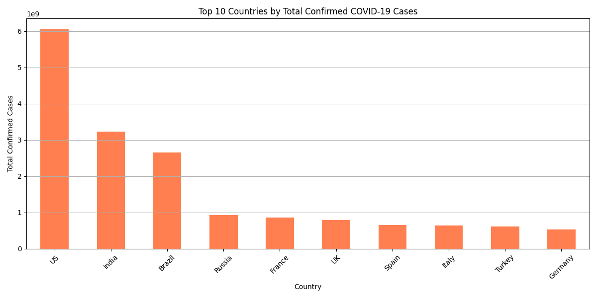

# covid19-data-analysis
A short analysis of COVID-19 data using Python and Matplotlib

# COVID-19 Data Analysis

This project analyzes global COVID-19 data and visualizes the top 10 countries with the highest confirmed cases.

## Tools Used:
- Python
- Pandas
- Matplotlib

## Output:

## Dataset:
Kaggle - COVID-19 Dataset
